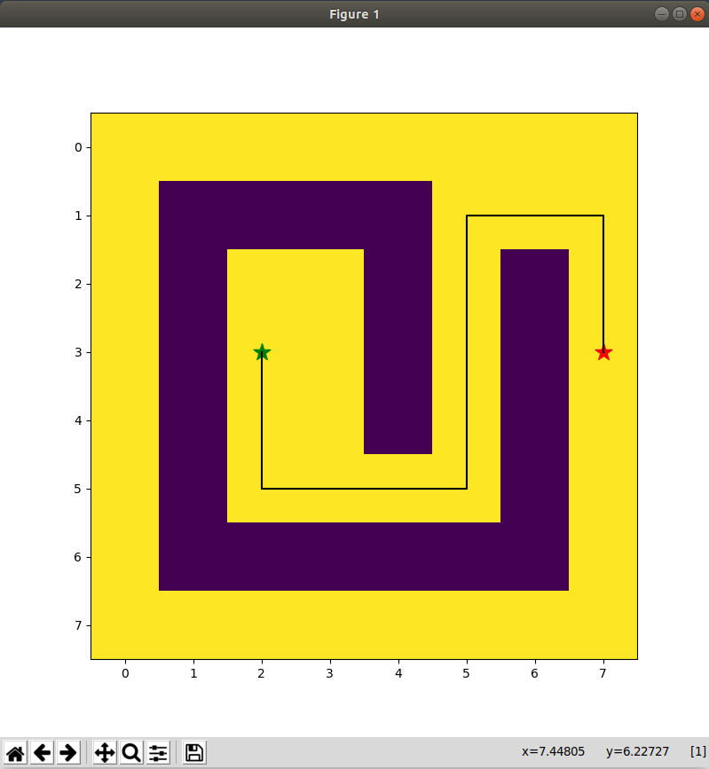
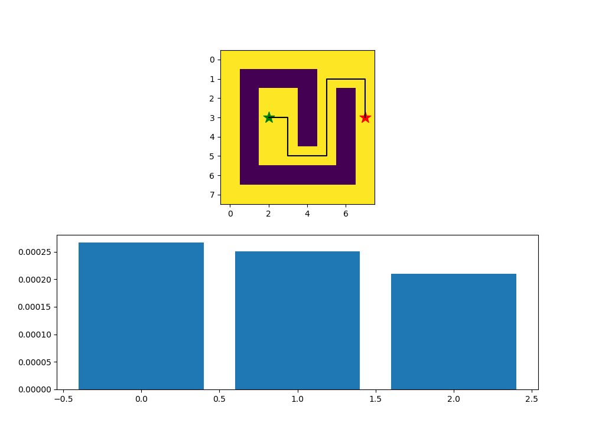

1. Astar algorithm written in python
2. Plotted the path using matplotlib.pyplot
3. Has three types of heuristics Manhattan, Diagonal, Euclidian.
4. This A\* only searches it's horizontal and vertical adjacent squares, not the diagonal. You can add diagonals too. The code will be same. Just put 4 more NW(i-1, j-1), NE(i-1, j+1), SW(i+1, j-1), SE(i+1, j+1) inside the 'while' loop.
5. Screenshot 
6. Comparison of 3 heuristics
   
